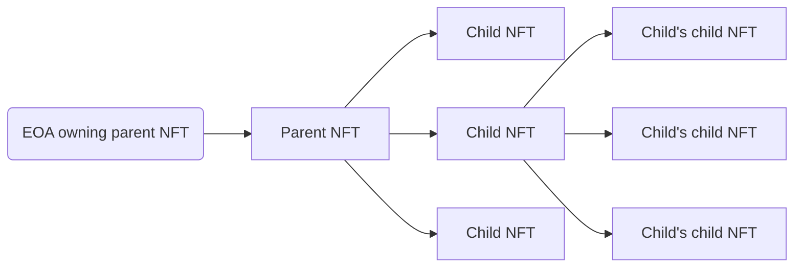

## Abstract

The Parent-Governed Nestable NFT standard extends the [EIP-721](./eip-721.md) by allowing for a new inter-NFT relationship and interaction.

At its core, the idea behind the proposal is simple: the owner of an NFT does not have to be an Externally Owned Account (EOA) or a smart contract, it can also be an NFT.

The process of nesting a NFT into another is functionally identical to sending it to another user. The process of sending a token out of another one involves issuing a transaction from the EOA ownining the parent token.

An NFT can be owned by a single other NFT, but can in turn have a number of NFTs that it owns. This proposal establishes the framework for the parent-child relationships of NFTs. A parent token is the one that owns another token. A child token is the token that is owned by another token. A token can be both a parent and child at the same time. Child tokens of a given tokens can be fully managed by the parent token's owner, but can be proposed by anyone.



The graph illustrates how a child token can also be a parent token, but both are still administered by the root parent token's owner.

## Motivation

With NFTs being a widespread form of tokens in the Ethereum ecosystem and being used for a variety of use cases, it is time to standardize additional utility for them. Having the ability for tokens to own other tokens allows for greater utility, usability and forward compatibility.

In the four years since [EIP-721](./eip-721.md) was published, the need for additional functionality has resulted in countless extensions. This EIP improves upon EIP-721 in the following areas:

- [Bundling](#bundling)
- [Collecting](#collecting)
- [Membership](#membership)
- [Delegation](#delegation)

### Bundling

One of the most frequent uses of [EIP-721](./eip-721.md) is to disseminate the multimedia content that is tied to the tokens. In the event that someone wants to offer a bundle of NFTs from various collections, there is currently no easy way of bundling all of these together and handle their sale as a single transaction. This proposal introduces a standardized way of doing so. Nesting all of the tokens into a simple bundle and selling that bundle would transfer the control of all of the tokens to the buyer in a single transaction.

### Collecting

A lot of NFT consumers collect them based on countless criteria. Some aim for utility of the tokens, some for the uniqueness, some for the visual appeal, etc. There is no standardized way to group the NFTs tied to a specific account. By nesting NFTs based on their owner's preference, this proposal introduces the ability to do it. The root parent token could represent a certain group of tokens and all of the children nested into it would belong to it.

The rise of soulbound, non-transferable, tokens, introduces another need for this proposal. Having a token with multiple solbound traits (child tokens), allows for numerous use cases. One concrete example of this can be drawn from supply trains usecase. A shipping container, represented by an NFT with its own traits, could have multiple child tokens denoting each leg of its journey.

### Membership

A common utility attached to NFTs is a membership to a Decentralised Autonomous Organization (DAO) or to some other closed-access group. Some of these organizations and groups ocasionally mint NFTs to the current holders of the membership NFTs. With the ability to nest mint a token into a token, such minting could be simplified, by simply minting the bonus NFT directly into the membership one.

### Delegation

One of the core features of DAOs is voting and there are various approaches to it. One such mechanic is using fungible voting tokens where members can delegate their votes by sending these tokens to another member. Using this proposal, delegated voting could be handled by nesting your voting NFT into the one you are delegating your votes to and unnesting it when the member no longer wishes to delegate their votes.

## Specification

The key words “MUST”, “MUST NOT”, “REQUIRED”, “SHALL”, “SHALL NOT”, “SHOULD”, “SHOULD NOT”, “RECOMMENDED”, “MAY”, and “OPTIONAL” in this document are to be interpreted as described in RFC 2119.

```solidity
/// @title EIP-X Nestable Non-Fungible Tokens
/// @dev See https://eips.ethereum.org/EIPS/eip-x
/// @dev Note: the ERC-165 identifier for this interface is 0x60b766e5.

pragma solidity ^0.8.16;

interface INestable {
    /**
     * @notice The core struct of ownership.
     * @dev The `DirectOwner` struct is used to store information of the next immediate owner, be it the parent token or
     *  the externally owned account.
     * @dev If the token is owned by the externally owned account, the `tokenId` MUST equal `0`.
     * @param tokenId ID of the parent token
     * @param ownerAddress Address of the owner of the token. If the owner is another token, then the address MUST be
     *  the one of the parent token's collection smart contract. If the owner is externally owned account, the address
     *  MUST be the address of this account
     * @param isNft A boolean value signifying whether the token is owned by another token (`true`) or by an externally
     *  owned account (`false`)
     */
    struct DirectOwner {
        uint256 tokenId;
        address ownerAddress;
        bool isNft;
    }

    /**
     * @notice Used to notify listeners that the token is being transferred.
     * @dev Emitted when `tokenId` token is transferred from `from` to `to`.
     * @param from Address of the previous immediate owner, which is a smart contract if the token was nested.
     * @param to Address of the new immediate owner, which is a smart contract if the token is being nested.
     * @param fromTokenId ID of the previous parent token. If the token was not nested before, the value MUST be `0`
     * @param toTokenId ID of the new parent token. If the token is not being nested, the value MUST be `0`
     * @param tokenId ID of the token being transferred
     */
    event NestTransfer(
        address indexed from,
        address indexed to,
        uint256 fromTokenId,
        uint256 toTokenId,
        uint256 indexed tokenId
    );

    /**
     * @notice Used to notify listeners that a new token has been added to a given token's pending children array.
     * @dev Emitted when a child NFT is added to a token's pending array.
     * @param tokenId ID of the token that received a new pending child token
     * @param childAddress Address of the proposed child token's collection smart contract
     * @param childId ID of the child token in the child token's collection smart contract
     * @param childIndex Index of the proposed child token in the parent token's pending children array
     */
    event ChildProposed(
        uint256 indexed tokenId,
        uint256 childIndex,
        address indexed childAddress,
        uint256 indexed childId
    );

    /**
     * @notice Used to notify listeners that a new child token was accepted by the parent token.
     * @dev Emitted when a parent token accepts a token from its pending array, migrating it to the active array.
     * @param tokenId ID of the token that accepted a new child token
     * @param childAddress Address of the child token's collection smart contract
     * @param childId ID of the child token in the child token's collection smart contract
     * @param childIndex Index of the newly accepted child token in the parent token's active children array
     */
    event ChildAccepted(
        uint256 indexed tokenId,
        uint256 childIndex,
        address indexed childAddress,
        uint256 indexed childId
    );

    /**
     * @notice Used to notify listeners that all pending child tokens of a given token have been rejected.
     * @dev Emitted when a token removes all a child tokens from its pending array.
     * @param tokenId ID of the token that rejected all of the pending children
     */
    event AllChildrenRejected(uint256 indexed tokenId);

    /**
     * @notice Used to notify listeners a child token has been unnested from parent token.
     * @dev Emitted when a token unnests a child from itself, transferring ownership to the root owner.
     * @param tokenId ID of the token that unnested a child token
     * @param childAddress Address of the child token's collection smart contract
     * @param childId ID of the child token in the child token's collection smart contract
     * @param childIndex Index of a child in the array from which it is being unnested
     * @param fromPending A boolean value signifying whether the token was in the pending child tokens array (`true`) or
     *  in the active child tokens array (`false`)
     */
    event ChildUnnested(
        uint256 indexed tokenId,
        uint256 childIndex,
        address indexed childAddress,
        uint256 indexed childId,
        bool fromPending
    );

    /**
     * @notice The core child token struct, holding the information about the child tokens.
     * @return tokenId ID of the child token in the child token's collection smart contract
     * @return contractAddress Address of the child token's smart contract
     */
    struct Child {
        uint256 tokenId;
        address contractAddress;
    }

    /**
     * @notice Used to retrieve the *root* owner of a given token.
     * @dev The *root* owner of the token is an externally owned account (EOA). If the given token is child of another
     *  NFT, this will return an EOA address. Otherwise, if the token is owned by an EOA, this EOA wil be returned.
     * @param tokenId ID of the token for which the *root* owner has been retrieved
     * @return owner The *root* owner of the token
     */
    function ownerOf(uint256 tokenId) external view returns (address owner);

    /**
     * @notice Used to retrieve the immediate owner of the given token.
     * @dev If the immediate owner is another token, the address returned, MUST be the one of the parent token's
     *  collection smart contract.
     * @param tokenId ID of the token for which the direct owner is being retrieved
     * @return address Address of the given token's owner
     * @return uint256 The ID of the parent token. MUST be `0` if the owner is an externally owned account
     * @return bool The boolean value signifying whether the owner is an NFT or not
     */
    function directOwnerOf(uint256 tokenId)
        external
        view
        returns (
            address,
            uint256,
            bool
        );

    /**
     * @notice Used to burn a given token.
     * @dev When a token is burned, all of its child tokens are recursively burned as well.
     * @dev When specifying the maximum recursive burns, the execution MUST be reverted if there are more children to be
     *  burned.
     * @dev Setting the `maxRecursiveBurn` value to 0 SHOULD only attempt to burn the specified token and MUST revert if
     *  there are any child tokens present.
     * @param tokenId ID of the token to burn
     * @param maxRecursiveBurns Maximum number of tokens to recursively burn
     * @return uint256 Number of recursively burned children
     */
    function burn(uint256 tokenId, uint256 maxRecursiveBurns)
        external
        returns (uint256);

    /**
     * @notice Used to add a child token to a given parent token.
     * @dev This adds the child token into the given parent token's pending child tokens array.
     * @dev Requirements:
     *
     *  - `directOwnerOf` on the child contract MUST resolve to the called contract.
     *  - the pending array of the parent contract MUST not be full.
     * @param parentId ID of the parent token to receive the new child token
     * @param childId ID of the new proposed child token
     */
    function addChild(uint256 parentId, uint256 childId) external;

    /**
     * @notice Used to accept a pending child token for a given parent token.
     * @dev This moves the child token from parent token's pending child tokens array into the active child tokens
     *  array.
     * @param parentId ID of the parent token for which the child token is being accepted
     * @param childIndex Index of the child token to accept in the pending children array of a given token
     * @param childAddress Address of the collection smart contract of the child token expected to be at the specified
     *  index
     * @param childId ID of the child token expected to be located at the specified index
     */
    function acceptChild(
        uint256 parentId,
        uint256 childIndex,
        address childAddress,
        uint256 childId
    ) external;

    /**
     * @notice Used to reject all pending children of a given parent token.
     * @dev Removes the children from the pending array mapping.
     * @dev The children's ownership structures are not updated.
     * @dev Requirements:
     *
     * - `parentId` MUST exist
     * @param parentId ID of the parent token for which to reject all of the pending tokens
     *
     */
    function rejectAllChildren(uint256 parentId) external;

    /**
     * @notice Used to unnest a child token from a given parent token.
     * @dev When unnesting a child token, the owner of the token MUST be set to `to`, or not updated in the event of `to`
     *  being the `0x0` address.
     * @param tokenId ID of the token from which to unnest a child token
     * @param to Address of the new owner of the child token being unnested
     * @param childIndex Index of the child token to unnest in the array it is located in
     * @param childAddress Address of the collection smart contract of the child token expected to be at the specified
     *  index
     * @param childId ID of the child token expected to be located at the specified index
     * @param isPending A boolean value signifying whether the child token is being unnested from the pending child
     *  tokens array (`true`) or from the active child tokens array (`false`)
     */
    function unnestChild(
        uint256 tokenId,
        address to,
        uint256 childIndex,
        address childAddress,
        uint256 childId,
        bool isPending
    ) external;

    /**
     * @notice Used to retrieve the active child tokens of a given parent token.
     * @dev Returns array of Child structs existing for parent token.
     * @dev The Child struct consists of the following values:
     *  [
     *      tokenId,
     *      contractAddress
     *  ]
     * @param parentId ID of the parent token for which to retrieve the active child tokens
     * @return struct[] An array of Child structs containing the parent token's active child tokens
     */
    function childrenOf(uint256 parentId)
        external
        view
        returns (Child[] memory);

    /**
     * @notice Used to retrieve the pending child tokens of a given parent token.
     * @dev Returns array of pending Child structs existing for given parent.
     * @dev The Child struct consists of the following values:
     *  [
     *      tokenId,
     *      contractAddress
     *  ]
     * @param parentId ID of the parent token for which to retrieve the pending child tokens
     * @return struct[] An array of Child structs containing the parent token's pending child tokens
     */
    function pendingChildrenOf(uint256 parentId)
        external
        view
        returns (Child[] memory);

    /**
     * @notice Used to retrieve a specific active child token for a given parent token.
     * @dev Returns a single Child struct locating at `index` of parent token's active child tokens array.
     * @dev The Child struct consists of the following values:
     *  [
     *      tokenId,
     *      contractAddress
     *  ]
     * @param parentId ID of the parent token for which the child is being retrieved
     * @param index Index of the child token in the parent token's active child tokens array
     * @return struct A Child struct containing data about the specified child
     */
    function childOf(uint256 parentId, uint256 index)
        external
        view
        returns (Child memory);

    /**
     * @notice Used to retrieve a specific pending child token from a given parent token.
     * @dev Returns a single Child struct locating at `index` of parent token's active child tokens array.
     * @dev The Child struct consists of the following values:
     *  [
     *      tokenId,
     *      contractAddress
     *  ]
     * @param parentId ID of the parent token for which the pending child token is being retrieved
     * @param index Index of the child token in the parent token's pending child tokens array
     * @return struct A Child struct containting data about the specified child
     */
    function pendingChildOf(uint256 parentId, uint256 index)
        external
        view
        returns (Child memory);

    /**
     * @notice Used to transfer the token into another token.
     * @param from Address of the collection smart contract of the token to be transferred
     * @param to Address of the receiving token's collection smart contract
     * @param tokenId ID of the token being transferred
     * @param destinationId ID of the token to receive the token being transferred
     */
    function nestTransferFrom(
        address from,
        address to,
        uint256 tokenId,
        uint256 destinationId
    ) external;
}
```

## Rationale

Designing the proposal, we considered the following questions:

1. **How to name the proposal?**

As this proposal standardizes the nesting of one `NFT` into another, the working title if the proposal was Nesting. In an effort to provide as much information about the proposal we identified the most important aspect of the proposal; the parent centered control over nesting. The 
child token's role is only to be able to be `Nestable` and support a token owning it. This is how we landed on the `Parent-Centered` part of the title.

2. **Why is automatically accepting a child using [EIP-712](./eip-712.md) permit-style signatures not a part of this proposal?**

Allowing automatic acceptance of child tokens in the same action as proposing them using the EIP-712 was considered. This would require adding support for automatic approval of the proposed tokens in addition to the propose-commit pattern already implemented in the proposal. While we agree this could be beneficial, we feel that it is not a required flow for the proposal to be operational. Adding support for it would also increase the file size and deployment cost of the smart contract implementing the proposal.

Supporting such flow of approvals as a default flow for accepting the proposed tokens also requires more gas to process the transaction than the current one. This can still be added as an extension or custom business logic by the implementer.

3. **Why use indexes?** 

To reduce the gas consumption. If the token ID was used to find which token to accept or reject, iteration over arrays would be required and the cost of the operation would depend on the size of the active or pending children arrays. With the index, the cost is fixed. A list of active and pending children arrays per token need to be maintained, since methods to get them are part of the proposed interface.

To avoid race conditions in which the index of a token changes, the expected token ID is included in operations requiring token index, to verify that the token being accessed using the index is the expected token.

Implementation that would internally keep track of indices using mapping was attempted. After experimenting with such implementation, we concluded that it is not necessary for this proposal and can be implemented as an extension for use cases willing to accept the increased transaction cost this incurs. In the sample implementation provided, there are several hooks which make this possible.

4. **Why is the pending children array limited instead of supporting pagination?**

The pending child tokens array is not meant to be a buffer to collect the tokens that the user wants to have, but not as active children. It is meant to be an easily traversible list of child token candidates and should be regularly maintained; by either accepting or rejecting proposed child tokens. There is also no need for the pending child tokens array to be unbounded, because active child tokens array is. This means that there is no motivation for the user to keep child tokens in the pending array in order not to consume the active child tokens array.

Another benefit of having bounded child tokens array is to guard against spam and griefing. As minting malisioud or spam tokens could be relatively easy and low-cost, the bounded pending array assures that all of the tokens in it are easy to identify and that legitimate tokens are not lost in a flood of spam tokens, if one occurs.

A consideration tied to this issue was also how to make sure, that a legitimate token is not accidentally rejected when clearing the pending child tokens array. We added the maximum pending children to reject argument to the clear pending child tokens array call. This assures that only the intended number of pending child tokens is rejected and if a new token is added to the pending child tokens array during the course of preparing such call and executing it, the cearing of this array SHOULD result in a reverted transaction.

5. **Should we allow tokens to be nested into one of its children?**

- This prevents tokens to be unintentionally put in limbo (could be considered burned as they can not be used any more, but for all intents and purposes these tokens still exist)

6. **How does this proposal differ from the other proposals trying to address a similar problem?**

- TODO: Add considerations & comparisons to other proposals

### Mutli-Asset Storage Schema

<!-- Addres how the pending and active arrays keep the token info and why this is more efficient than a single tokens array -->

### Propose-Commit pattern for child token management

<!-- Make sure it comes accross that this protests the token from spam and malicious children -->

### Child token management

<!-- Explain the need for many child management function to provide all of the required functionality for standard use of this proposal -->

## Backwards Compatibility

The Nestable token standard has been made compatible with [EIP-721](./eip-721.md) in order to take advantage of the robust tooling available for implementations of EIP-721 and to ensure compatibility with existing EIP-721 infrastructure.

## Test Cases

Tests are included in [`nestable.ts`](../assets/eip-xxxx/test/nestable.ts).

To run them in terminal, you can use the following commands:

```
cd ../assets/eip-xxxx
npm install
npx hardhat test
```

## Reference Implementation

See [`NestableToken.sol`](../assets/eip-xxxx/contracts/NestableToken.sol).


## Security Considerations

The same security considerations as with [EIP-721](./eip-721.md) apply: hidden logic may be present in any of the functions, including burn, add resource, accept resource, and more.

Caution is advised when dealing with non-audited contracts.

## Copyright

Copyright and related rights waived via [CC0](../LICENSE.md).